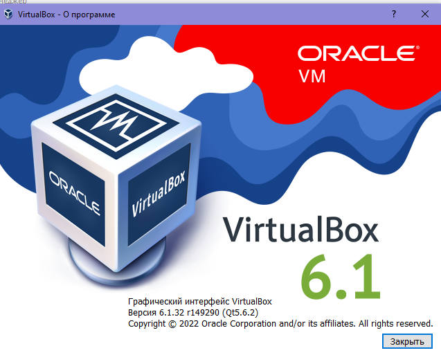

# Домашнее задание к занятию "5.2. Системы управления виртуализацией"

## Задача 1 

- Опишите своими словами основные преимущества применения на практике IaaC паттернов.
1. упрощает разработку программ
2. программист столкнувшийся с чужим кодом, знает примененный патерн проектирования и его принципы, ему будет проще понять реализацию и внести изменения в код.
- Какой из принципов IaaC является основополагающим?
 *Описывать любую сущность в виде кода*

## Задача 2

- Чем Ansible выгодно отличается от других систем управление конфигурациями?
*простота входа* 
- Какой, на ваш взгляд, метод работы систем конфигурации более надёжный push или pull?
*Кажется как будто pull более надежный, потому что доставка необходимых ресурсов ложится на клиента*

## Задача 3 

Установить на личный компьютер:

- VirtualBox - т.к. у меня винда, версии в выводе нет.

- Vagrant 
```bash
$ vagrant -v
Vagrant 2.2.19
```
- Ansible
Не могу найти как установить на винде. Задание со звездочкой тоже из-за этого сделать не получается. У меня есть подсистема WSL2, но там вообще вагрант через костыль надо настроить чтобы работал. Может подскажете, как мне работать, чтобы с винды...

- *Приложить вывод команд установленных версий каждой из программ, оформленный в markdown.*

## Задача 4 (*)

Воспроизвести практическую часть лекции самостоятельно.

- Создать виртуальную машину.
- Зайти внутрь ВМ, убедиться, что Docker установлен с помощью команды
```
docker ps
```

---

### Как cдавать задание

Выполненное домашнее задание пришлите ссылкой на .md-файл в вашем репозитории.

---
