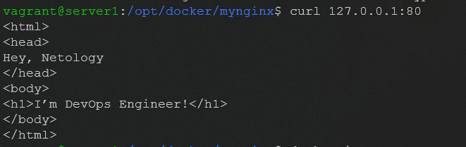

# Домашнее задание к занятию "5.3. Введение. Экосистема. Архитектура. Жизненный цикл Docker контейнера"

## Задача 1 

Сценарий выполения задачи:

- создайте свой репозиторий на https://hub.docker.com;
- выберете любой образ, который содержит веб-сервер Nginx;

- создайте свой fork образа;
- реализуйте функциональность: запуск веб-сервера в фоне с индекс-страницей, содержащей HTML-код ниже:
```html
<html>
<head>
Hey, Netology
</head>
<body>
<h1>I’m DevOps Engineer!</h1>
</body>
</html>
```
Опубликуйте созданный форк в своем репозитории и предоставьте ответ в виде ссылки на https://hub.docker.com/username_repo.

https://hub.docker.com/repository/docker/eavdeeva/virthomeworks (tag ura)

## Задача 2 

Посмотрите на сценарий ниже и ответьте на вопрос: "Подходит ли в этом сценарии использование Docker контейнеров или лучше подойдет виртуальная машина, физическая машина? Может быть возможны разные варианты?"

Детально опишите и обоснуйте свой выбор.

--

Сценарий:

* Высоконагруженное монолитное java веб-приложение;
- лучше физический сервер, т.к. в микросерверах невозможно реализовать без изменения кода, а из-за высоконагруженности необходим физический доступ к ресурсам.
* Nodejs веб-приложение;
- я бы использовала Docker, т.к. он идеально работает с микросервисами, а  Node.js идеальный выбор для микросервисной архитектуры
* Мобильное приложение c версиями для Android и iOS;
- т.к. Docker не подходит для приложений, предполагающих наличие полнофункционального UI, то в этом случае выберу виртуалку.
* Шина данных на базе Apache Kafka;
- чтобы минимизировать риски потери данных, пусть будет виртуалка.
* Elasticsearch кластер для реализации логирования продуктивного веб-приложения - три ноды elasticsearch, два logstash и две ноды kibana;
- Реализовать можно на виртуалке и с помощью docker. Зависит от потребностей, если важна безопасность, то лучше первый вариант.  
* Мониторинг-стек на базе Prometheus и Grafana;
- docker, т.к. высокая скорость, а использование ресурсов варьируется в зависимости от нагрузки или трафика в нем 
* MongoDB, как основное хранилище данных для java-приложения;
- контейнеризация БД позволяет выстроить все элементы системы на одном уровне абстракции. Что, в свою очередь, делает возможным управление этой самой системой прямо из кода, разработчиками, без активного привлечения админов.  
Но могут возникнуть сложности, если данные нужно будет перенести, более того при прекращении работы контейнера данные буду безвозвратно утеряны. Так что, исходя из этого, лучше виртуалка 
* Gitlab сервер для реализации CI/CD процессов и приватный (закрытый) Docker Registry.
- чтобы вести разработку приложения в Docker, следует дополнительно продумать и настроить рабочие процессы. Кроме того, для дебаггинга в Docker нужно настроить вывод логов и порты для отладки. Может также понадобиться назначить порты для ваших приложений и сервисов в контейнерах.
## Задача 3 

* Запустите первый контейнер из образа centos c любым тэгом в фоновом режиме, подключив папку /data из текущей рабочей директории на хостовой машине в /data контейнера;
* Запустите второй контейнер из образа debian в фоновом режиме, подключив папку /data из текущей рабочей директории на хостовой машине в /data контейнера;
* Подключитесь к первому контейнеру с помощью docker exec и создайте текстовый файл любого содержания в /data;
* Добавьте еще один файл в папку /data на хостовой машине;
* Подключитесь во второй контейнер и отобразите листинг и содержание файлов в /data контейнера.


## Задача 4 (*)
Воспроизвести практическую часть лекции самостоятельно.

Соберите Docker образ с Ansible, загрузите на Docker Hub и пришлите ссылку вместе с остальными ответами к задачам.

---

### Как cдавать задание

Выполненное домашнее задание пришлите ссылкой на .md-файл в вашем репозитории.

---
