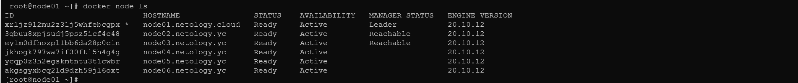
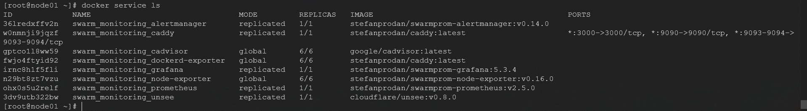

# Домашнее задание к занятию "5.5. Оркестрация кластером Docker контейнеров на примере Docker Swarm"

## Задача 1 

Дайте письменые ответы на следующие вопросы:

* В чём отличие режимов работы сервисов в Docker Swarm кластере: replication и global?
1. Replicated services - можно указать количество выполненных задач.
2. Global services - запустить одну и ту же задачу на каждом узле.
* Какой алгоритм выбора лидера используется в Docker Swarm кластере?
- используется алгоритм поддержания распределенного консенсуса — Raft. В кластере могут одновременно работать несколько управляющих нод, которые могут в любой момент заменить вышедшего из строя лидера
* Что такое Overlay Network?
- виртуальная сеть туннелей, работающая "поверх" физической.
- 
## Задача 2

Создать ваш первый Docker Swarm кластер в Яндекс.Облаке

Для получения зачета, вам необходимо предоставить скриншот из терминала (консоли), с выводом команды:
```
docker node ls
```


## Задача 3 

Создать ваш первый, готовый к боевой эксплуатации кластер мониторинга, состоящий из стека микросервисов.

Для получения зачета, вам необходимо предоставить скриншот из терминала (консоли), с выводом команды:
```
docker service ls
```

## Задача 4 (*)

Выполнить на лидере Docker Swarm кластера команду (указанную ниже) и дать письменное описание её функционала, что она делает и зачем она нужна:
```
# см.документацию: https://docs.docker.com/engine/swarm/swarm_manager_locking/
docker swarm update --autolock=true
```


---
