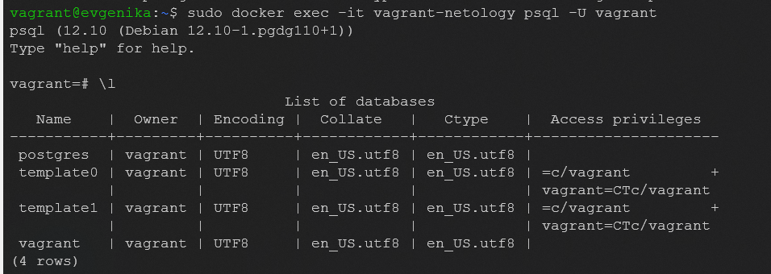
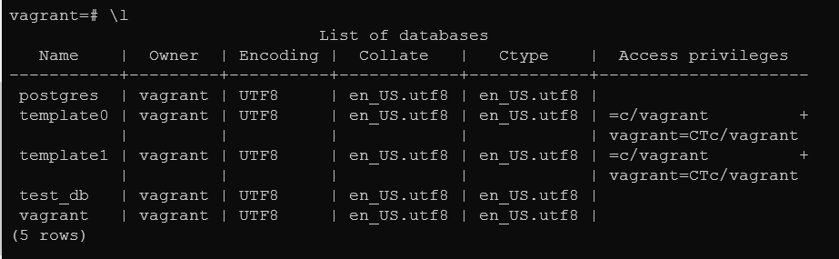
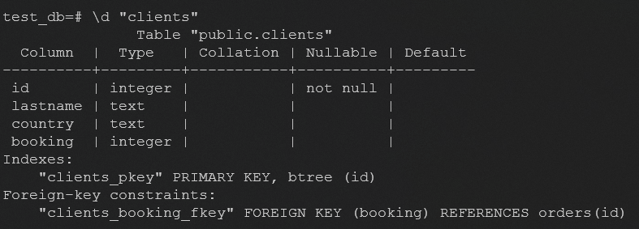
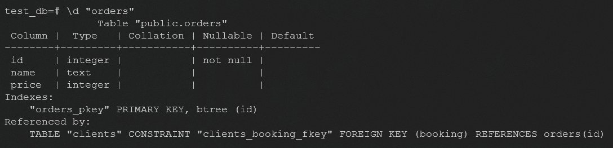
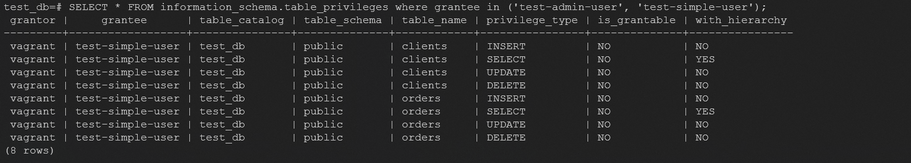
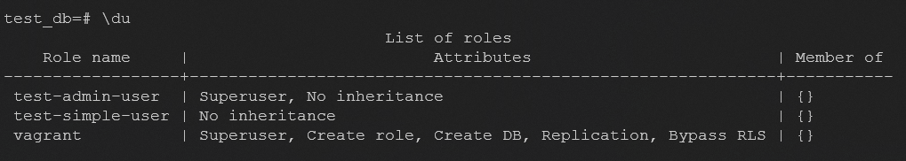
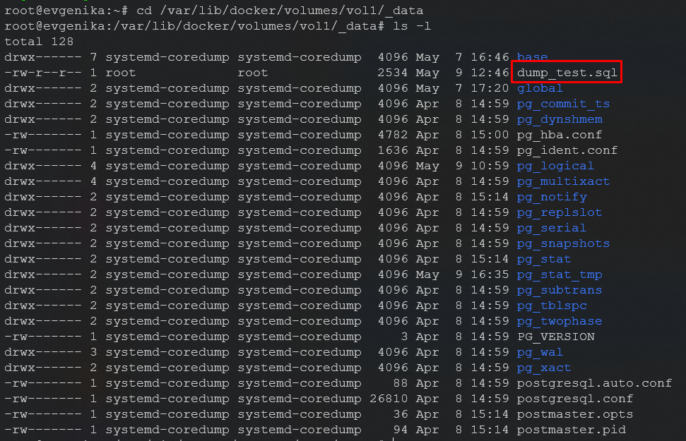
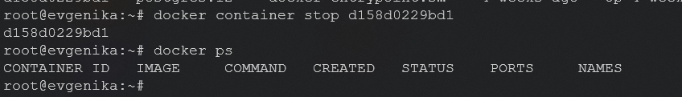
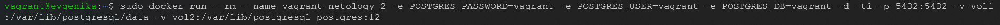
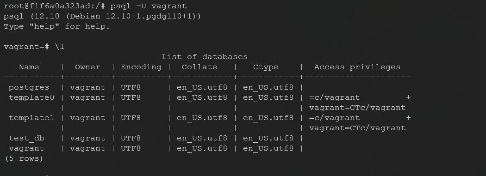

 # Домашнее задание к занятию "6.2. SQL"

## Введение

Перед выполнением задания вы можете ознакомиться с 
[дополнительными материалами](https://github.com/netology-code/virt-homeworks/tree/master/additional/README.md).

## Задача 1

Используя docker поднимите инстанс PostgreSQL (версию 12) c 2 volume, 
в который будут складываться данные БД и бэкапы.

Приведите получившуюся команду или docker-compose манифест.
```bash
vagrant@evgenika:~$ docker pull postgres:12
vagrant@evgenika:~$ docker volume create vol2
vagrant@evgenika:~$ docker volume create vol1
vagrant@evgenika:~$ sudo docker run --rm --name vagrant-netology -e POSTGRES_PASSWORD=vagrant -e POSTGRES_USER=vagrant -e POSTGRES_DB=vagrant -d -ti -p 2222:2222 -v vol1:/var/lib/postgresql/data -v vol2:/var/lib/postgresql postgres:12
d158d0229bd1f533e74df5d30279288f9a45762e2545e3ebe10cae3eaaff144e
```


## Задача 2

В БД из задачи 1: 
- создайте пользователя test-admin-user и БД test_db
```bash
vagrant=# CREATE DATABASE test_db;
CREATE DATABASE
vagrant=# CREATE ROLE "test-admin-user" SUPERUSER NOCREATEDB NOCREATEROLE NOINHERIT LOGIN;
CREATE ROLE
```
- в БД test_db создайте таблицу orders и clients (спeцификация таблиц ниже)
```bash
test_db=# CREATE TABLE orders
(
id integer,
name text,
price integer,
PRIMARY KEY (id)
);
CREATE TABLE
test_db=# CREATE TABLE clients
(
        id integer PRIMARY KEY,
        lastname text,
        country text,
        booking integer,
        FOREIGN KEY (booking) REFERENCES orders (Id)
);
CREATE TABLE
```
- предоставьте привилегии на все операции пользователю test-admin-user на таблицы БД test_db
- создайте пользователя test-simple-user
```shell
test_db=# CREATE ROLE "test-simple-user" NOSUPERUSER NOCREATEDB NOCREATEROLE NOINHERIT LOGIN;
CREATE ROLE
```
- предоставьте пользователю test-simple-user права на SELECT/INSERT/UPDATE/DELETE данных таблиц БД test_db
```shell
test_db=# GRANT SELECT ON TABLE public.clients TO "test-simple-user";
GRANT
test_db=# GRANT INSERT ON TABLE public.clients TO "test-simple-user";
GRANT
test_db=# GRANT UPDATE ON TABLE public.clients TO "test-simple-user";
GRANT
test_db=# GRANT DELETE ON TABLE public.clients TO "test-simple-user";
GRANT
test_db=# GRANT SELECT ON TABLE public.orders TO "test-simple-user";
GRANT
test_db=# GRANT INSERT ON TABLE public.orders TO "test-simple-user";
GRANT
test_db=# GRANT UPDATE ON TABLE public.orders TO "test-simple-user";
GRANT
test_db=# GRANT DELETE ON TABLE public.orders TO "test-simple-user";
GRANT
```
Таблица orders:
- id (serial primary key)
- наименование (string)
- цена (integer)

Таблица clients:
- id (serial primary key)
- фамилия (string)
- страна проживания (string, index)
- заказ (foreign key orders)

Приведите:
- итоговый список БД после выполнения пунктов выше

- описание таблиц (describe)


- SQL-запрос для выдачи списка пользователей с правами над таблицами test_db

- список пользователей с правами над таблицами test_db


## Задача 3


Используя SQL синтаксис - наполните таблицы следующими тестовыми данными:

Таблица orders

|Наименование|цена|
|------------|----|
|Шоколад| 10 |
|Принтер| 3000 |
|Книга| 500 |
|Монитор| 7000|
|Гитара| 4000|

Таблица clients

|ФИО|Страна проживания|
|------------|----|
|Иванов Иван Иванович| USA |
|Петров Петр Петрович| Canada |
|Иоганн Себастьян Бах| Japan |
|Ронни Джеймс Дио| Russia|
|Ritchie Blackmore| Russia|

```shell
test_db=# insert into orders VALUES (1, 'Шоколад', 10), (2, 'Принтер', 3000), (3, 'Книга', 500), (4, 'Монитор', 7000), (5, 'Гитара', 4000);
INSERT 0 5
test_db=# insert into clients VALUES (1, 'Иванов Иван Иванович', 'USA'), (2, 'Петров Петр Петрович', 'Canada'), (3, 'Иоганн Себастьян Бах', 'Japan'), (4, 'Ронни Джеймс Дио', 'Russia'), (5, 'Ritchie Blackmore', 'Russia');
INSERT 0 5
```
Используя SQL синтаксис:
- вычислите количество записей для каждой таблицы 
```shell
test_db=# select count (*) from orders;
 count
-------
     5
(1 row)

test_db=# select count (*) from clients;
 count
-------
     5
(1 row)
```
- приведите в ответе:
    - запросы 
    - результаты их выполнения.

## Задача 4

Часть пользователей из таблицы clients решили оформить заказы из таблицы orders.
Используя foreign keys свяжите записи из таблиц, согласно таблице:

|ФИО|Заказ|
|------------|----|
|Иванов Иван Иванович| Книга |
|Петров Петр Петрович| Монитор |
|Иоганн Себастьян Бах| Гитара |

Приведите SQL-запросы для выполнения данных операций.
```shell
test_db=# update clients set booking = 3 where id = 1;
UPDATE 1
test_db=# update  clients set booking = 4 where id = 2;
UPDATE 1
test_db=# update  clients set booking = 5 where id = 3;
UPDATE 1
```
Приведите SQL-запрос для выдачи всех пользователей, которые совершили заказ, а также вывод данного запроса.
```shell
test_db=# SELECT * FROM clients WHERE booking IS NOT NULL;
 id |       lastname       | country | booking
----+----------------------+---------+---------
  1 | Иванов Иван Иванович | USA     |       3
  2 | Петров Петр Петрович | Canada  |       4
  3 | Иоганн Себастьян Бах | Japan   |       5
(3 rows)
```
 
Подсказка - используйте директиву `UPDATE`. ❤️

## Задача 5

Получите полную информацию по выполнению запроса выдачи всех пользователей из задачи 4 
(используя директиву EXPLAIN).
```shell
test_db=# EXPLAIN SELECT * FROM clients WHERE booking IS NOT NULL;
                       QUERY PLAN
--------------------------------------------------------
 Seq Scan on clients  (cost=0.00..1.05 rows=3 width=47)
   Filter: (booking IS NOT NULL)
(2 rows)
```
cost - затратность операции
- 0.00 — затраты на получение первой строки.
- 1.05 — затраты на получение всех строк.

rows — приблизительное количество возвращаемых строк при выполнении операции Seq Scan.
width — средний размер одной строки в байтах.

Приведите получившийся результат и объясните что значат полученные значения.


## Задача 6

Создайте бэкап БД test_db и поместите его в volume, предназначенный для бэкапов (см. Задачу 1).
```shell
vagrant@evgenika:~$ docker exec -i vagrant-netology pg_dump -U vagrant test_db -f /var/lib/postgresql/data/dump_test.sql
```

Остановите контейнер с PostgreSQL (но не удаляйте volumes).

Поднимите новый пустой контейнер с PostgreSQL.

Восстановите БД test_db в новом контейнере.
- При создании нового контейнера volumes подключились автоматически и БД восстановилась автоматически

```shell
vagrant=# \dt
Did not find any relations.
vagrant=# \c test_db
You are now connected to database "test_db" as user "vagrant".
test_db=# \dt
         List of relations
 Schema |  Name   | Type  |  Owner
--------+---------+-------+---------
 public | clients | table | vagrant
 public | orders  | table | vagrant
(2 rows)

test_db=# select * from clients;
 id |       lastname       | country | booking
----+----------------------+---------+---------
  4 | Ронни Джеймс Дио     | Russia  |
  5 | Ritchie Blackmore    | Russia  |
  1 | Иванов Иван Иванович | USA     |       3
  2 | Петров Петр Петрович | Canada  |       4
  3 | Иоганн Себастьян Бах | Japan   |       5
(5 rows)

test_db=# select * from orders;
 id |  name   | price
----+---------+-------
  1 | Шоколад |    10
  2 | Принтер |  3000
  3 | Книга   |   500
  4 | Монитор |  7000
  5 | Гитара  |  4000
(5 rows)
```
Приведите список операций, который вы применяли для бэкапа данных и восстановления. 

---

### Как cдавать задание

Выполненное домашнее задание пришлите ссылкой на .md-файл в вашем репозитории.

---
